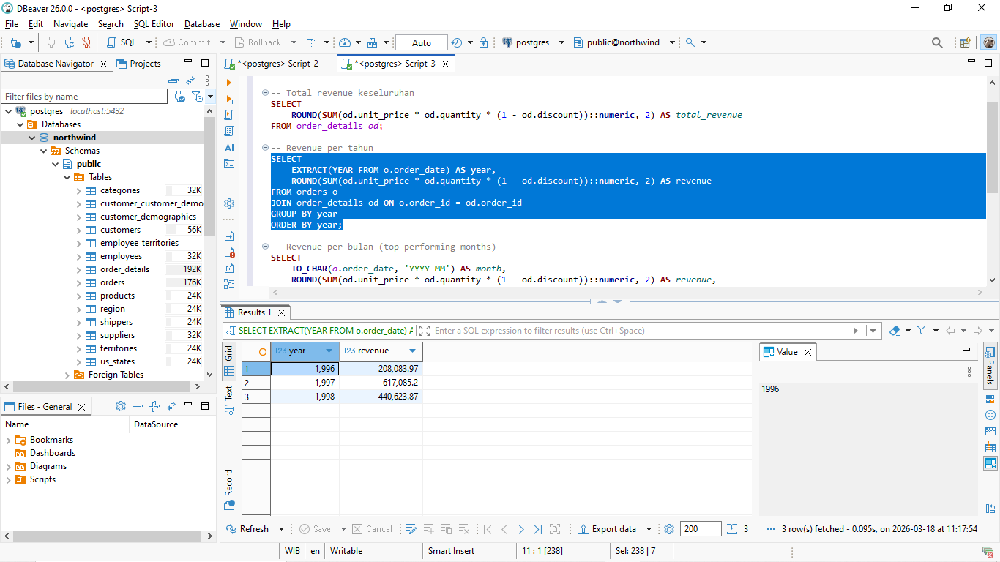
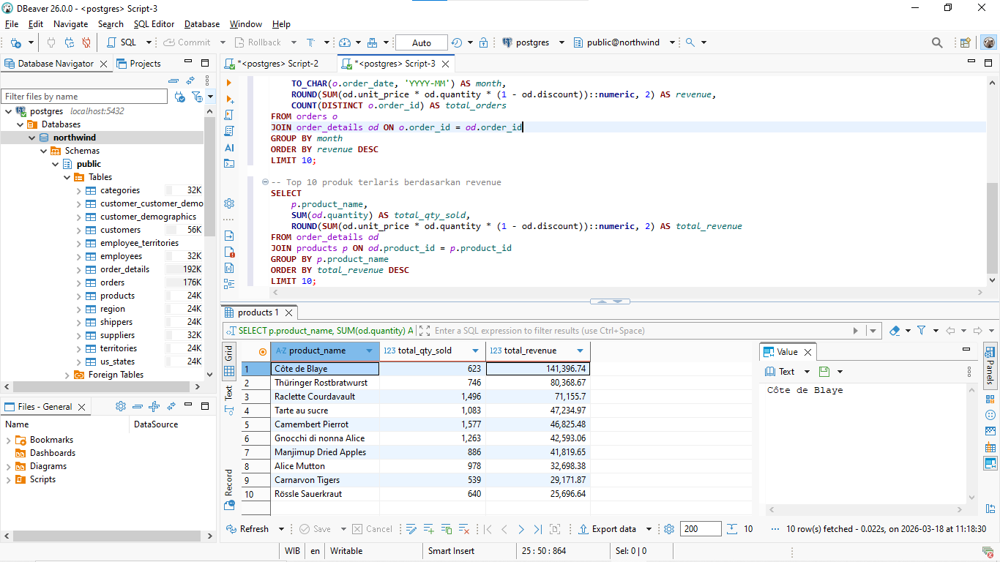
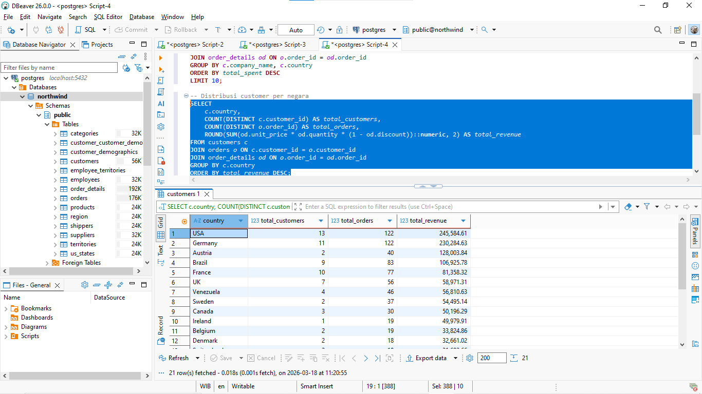
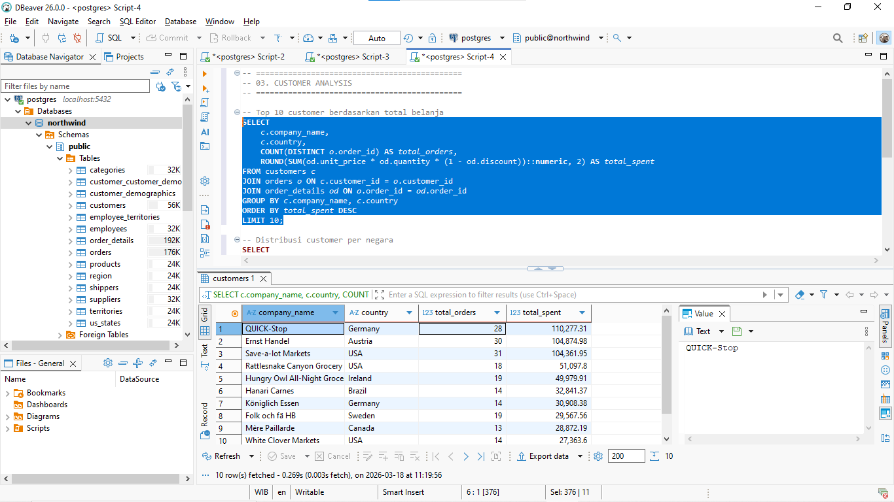
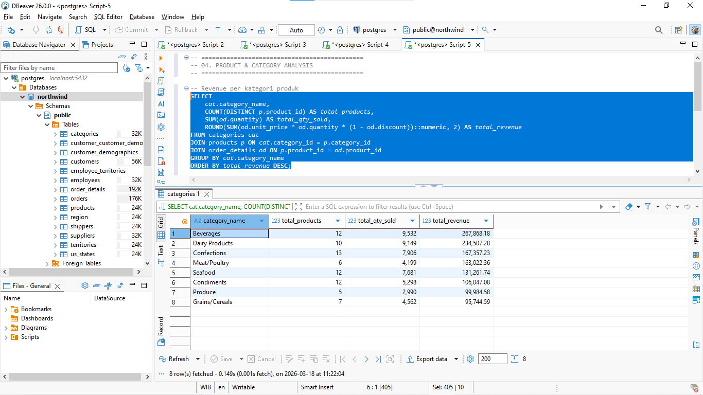
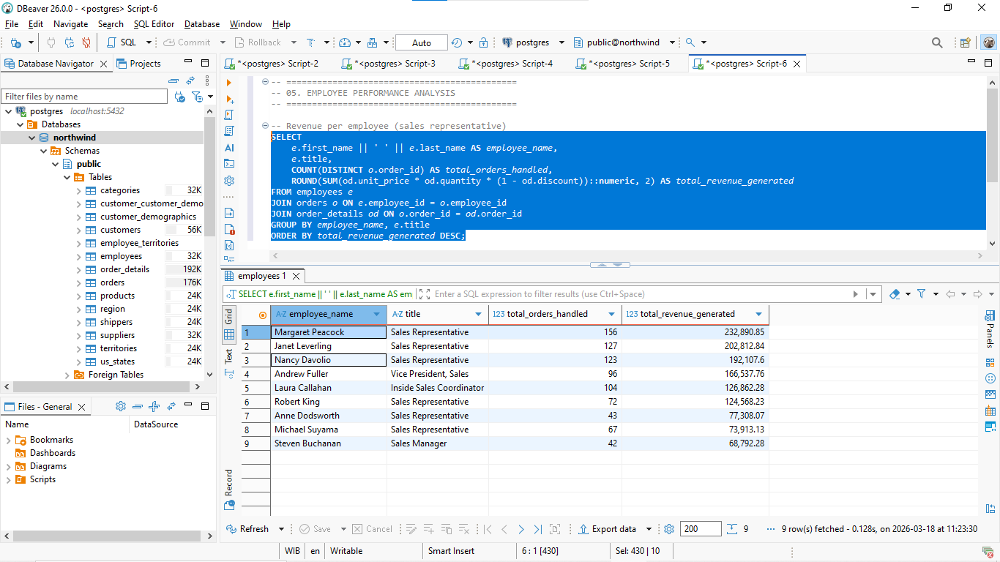

# SQL Business Analytics — Northwind Database

Analyzing a fictional food distribution company using pure SQL on PostgreSQL. The analysis covers 5 areas: sales performance, customer behavior, product & category breakdown, employee performance, and inventory status.

---

## Dataset

**Source:** Northwind Database — a classic sample dataset simulating a food and beverage distribution company.

| Table | Records |
|-------|---------|
| Customers | 91 customers |
| Orders | 830 transactions |
| Products | 77 products |
| Data period | July 4, 1996 – May 6, 1998 |

---

## Tools & Technologies

| Tool | Purpose |
|------|---------|
| **PostgreSQL 17** | Database engine |
| **DBeaver Community** | SQL query editor & GUI |
| **Git & GitHub** | Version control |

---

## Business Questions

| # | Question |
|---|----------|
| 1 | What is the year-over-year revenue trend? |
| 2 | Which months consistently produce the highest sales? |
| 3 | Which products and categories generate the most revenue? |
| 4 | Who are the highest-value customers? |
| 5 | Which countries are the main markets? |
| 6 | Which employees have the best performance by revenue? |
| 7 | Which products need restocking immediately? |

---

## Project Structure
```
SQL-Business-Analytics---Northwind-Database/
│
├── dataset/
│   └── northwind.sql               # Raw database dump
│
├── queries/
│   ├── 01_basic_exploration.sql    # Data structure exploration
│   ├── 02_sales_performance.sql    # Sales trend analysis
│   ├── 03_customer_analysis.sql    # Customer behavior analysis
│   ├── 04_product_category.sql     # Product & category analysis
│   └── 05_employee_performance.sql # Employee performance analysis
│
├── results/
│   ├── 01_data_overview.png
│   ├── 02_revenue_per_year.png
│   ├── 03_top10_products.png
│   ├── 04_top10_customers.png
│   ├── 05_revenue_by_country.png
│   ├── 06_revenue_by_category.png
│   ├── 07_low_stock_products.png
│   └── 08_employee_performance.png
│
└── README.md
```

---

## Key Findings

### 1. Annual Revenue Trend

| Year | Revenue | Note |
|------|---------|------|
| 1996 | $208,083.97 | July–December only |
| 1997 | $617,085.20 | Full year — strongest year, +197% vs 1996 |
| 1998 | $440,623.87 | January–May only (data cut off) |

**Total revenue across all periods: $1,265,793.04.** If 1998 data ran a full year, the annualized trend suggests it would have exceeded 1997.

---

### 2. Best Sales Months

| Rank | Period | Revenue | Orders |
|------|--------|---------|--------|
| 1 | April 1998 | $123,798.68 | 74 |
| 2 | March 1998 | $104,854.16 | — |
| 3 | February 1998 | $99,415.29 | — |

The top 3 months are all from early 1998 — consistent with the upward growth trajectory from 1997 onward.

---

### 3. Top 10 Products by Revenue

| Rank | Product | Qty Sold | Revenue |
|------|---------|----------|---------|
| 1 | Côte de Blaye | 623 | $141,396.74 |
| 2 | Thüringer Rostbratwurst | 746 | $80,368.67 |
| 3 | Raclette Courdavault | 1,496 | $71,155.70 |
| 4 | Tarte au sucre | 1,083 | $47,234.97 |
| 5 | Camembert Pierrot | 1,577 | $46,825.48 |
| 6 | Gnocchi di nonna Alice | 1,263 | $42,593.06 |
| 7 | Manjimup Dried Apples | 886 | $41,819.65 |
| 8 | Alice Mutton | 978 | $32,698.38 |
| 9 | Carnarvon Tigers | 539 | $29,171.87 |
| 10 | Rössle Sauerkraut | 640 | $25,696.64 |

Côte de Blaye leads in revenue despite not being the highest-volume product — a clear indicator of premium pricing. Raclette Courdavault and Camembert Pierrot are the volume leaders at mid-range price points.

---

### 4. Revenue by Country

| Rank | Country | Customers | Orders | Revenue |
|------|---------|-----------|--------|---------|
| 1 | USA | 13 | 122 | $245,584.61 |
| 2 | Germany | 11 | 122 | $230,284.63 |
| 3 | Austria | 2 | 40 | $128,003.84 |
| 4 | Brazil | 9 | 83 | $106,925.78 |
| 5 | France | 10 | 77 | $81,358.32 |

Austria is the outlier: only 2 customers but $128K in revenue — both are extremely high-value accounts that carry significant churn risk.

---

### 5. Top 10 Customers

| Rank | Customer | Country | Orders | Total Spent |
|------|---------|---------|--------|-------------|
| 1 | QUICK-Stop | Germany | 28 | $110,277.31 |
| 2 | Ernst Handel | Austria | 30 | $104,874.98 |
| 3 | Save-a-lot Markets | USA | 31 | $104,361.95 |
| 4 | Rattlesnake Canyon Grocery | USA | 18 | $51,097.80 |
| 5 | Hungry Owl All-Night Groce | Ireland | 19 | $49,979.91 |
| 6 | Hanari Carnes | Brazil | 14 | $32,841.37 |
| 7 | Königlich Essen | Germany | 14 | $30,908.38 |
| 8 | Folk och fä HB | Sweden | 19 | $29,567.56 |
| 9 | Mère Paillarde | Canada | 13 | $28,872.19 |
| 10 | White Clover Markets | USA | 14 | $27,363.60 |

QUICK-Stop has the highest average order value at **$1,282.29 per transaction**.

---

### 6. Revenue by Product Category

| Rank | Category | Products | Qty Sold | Revenue |
|------|---------|---------|----------|---------|
| 1 | Beverages | 12 | 9,532 | $267,868.18 |
| 2 | Dairy Products | 10 | 9,149 | $234,507.28 |
| 3 | Confections | 13 | 7,906 | $167,357.23 |
| 4 | Meat/Poultry | 6 | 4,199 | $163,022.36 |
| 5 | Seafood | 12 | 7,681 | $131,261.74 |
| 6 | Condiments | 12 | 5,298 | $106,047.08 |
| 7 | Produce | 5 | 2,990 | $99,984.58 |
| 8 | Grains/Cereals | 7 | 4,562 | $95,744.59 |

Beverages and Dairy Products together account for ~40% of total revenue. Meat/Poultry is worth noting — only 6 products but 4th highest revenue, meaning high unit price.

---

### 7. Employee Performance

| Rank | Employee | Title | Orders | Revenue |
|------|---------|-------|--------|---------|
| 1 | Margaret Peacock | Sales Representative | 156 | $232,890.85 |
| 2 | Janet Leverling | Sales Representative | 127 | $202,812.84 |
| 3 | Nancy Davolio | Sales Representative | 123 | $192,107.60 |
| 4 | Andrew Fuller | Vice President, Sales | 96 | $166,537.76 |
| 5 | Laura Callahan | Inside Sales Coordinator | 104 | $126,862.28 |
| 6 | Robert King | Sales Representative | 72 | $124,568.23 |
| 7 | Anne Dodsworth | Sales Representative | 43 | $77,308.07 |
| 8 | Michael Suyama | Sales Representative | 67 | $73,913.13 |
| 9 | Steven Buchanan | Sales Manager | 42 | $68,792.28 |

Margaret Peacock leads on both order count (156) and revenue ($232,890).

---

### 8. Delivery Efficiency

| Rank | Employee | Avg. Delivery Days |
|------|---------|-------------------|
| 1 | Steven Buchanan | 7.0 days |
| 2 | Nancy Davolio | 7.8 days |
| 3 | Andrew Fuller | 8.1 days |
| 9 | Anne Dodsworth | 10.9 days |

Anne Dodsworth has the slowest delivery time and the second-lowest revenue — two flags worth looking at together.

---

### 9. Products Needing Immediate Restock

18 products are below their reorder level. Most critical:

| Product | Stock | Reorder Level | Status |
|---------|-------|---------------|--------|
| Gorgonzola Telino | 0 | 20 | Out of stock |
| Louisiana Hot Spiced Okra | 4 | 20 | Critical |
| Sir Rodney's Scones | 3 | 5 | Critical |
| Longlife Tofu | 4 | 5 | Critical |
| Rogede sild | 5 | 15 | Critical |

---

## Business Recommendations

| Priority | Recommendation |
|----------|---------------|
| Urgent | Restock Gorgonzola Telino immediately (stock = 0) and the 17 other products below reorder level |
| High | Protect Austria accounts (Ernst Handel) — 2 customers worth $128K is a concentration risk |
| High | Expand in Germany — same order count as USA but fewer customers, meaning higher per-customer value |
| Medium | Double down on Beverages & Dairy — two categories driving ~40% of total revenue |
| Medium | Investigate Anne Dodsworth — slowest delivery and near-lowest revenue needs attention |

---

## How to Run

1. Install PostgreSQL (version 16 or 17)
2. Create a new database named `northwind`
3. Import the dataset:
```sql
-- In DBeaver or psql, run:
\i dataset/northwind.sql
```
4. Run the query files in order from `01` to `05` inside the `queries/` folder

---

## Query Results

### Revenue Per Year


### Top 10 Products by Revenue


### Revenue by Country


### Top 10 Customers


### Revenue by Category


### Employee Performance


---

## Author

**Arnoldew Ray Ruby**
- GitHub: [@Arnoldew](https://github.com/Arnoldew)
- LinkedIn: [arnoldew-ray-ruby](https://www.linkedin.com/in/arnoldew-ray-ruby/)

---

*Part of a 10-project data analyst portfolio.*
